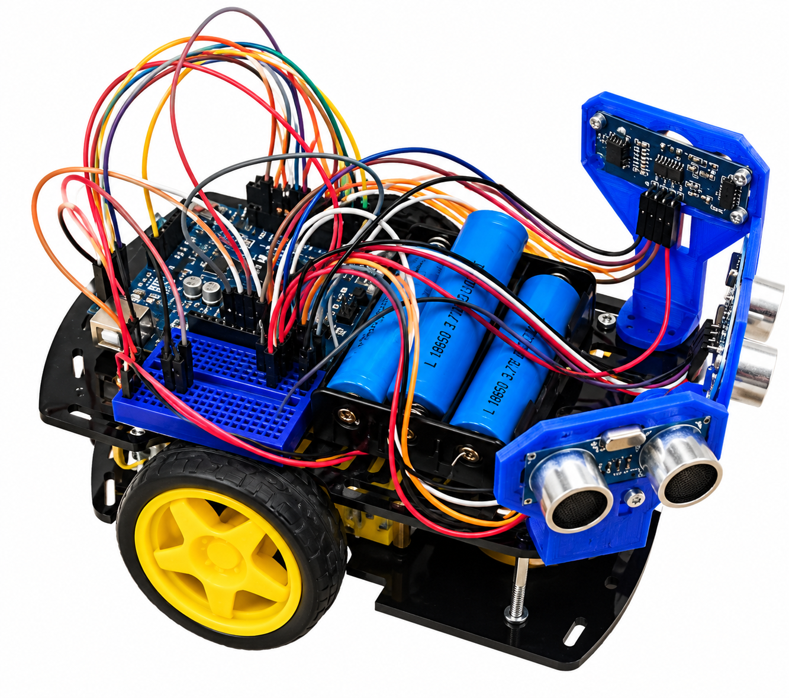
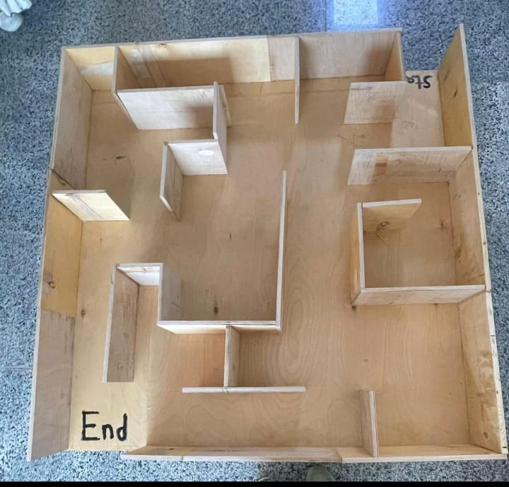
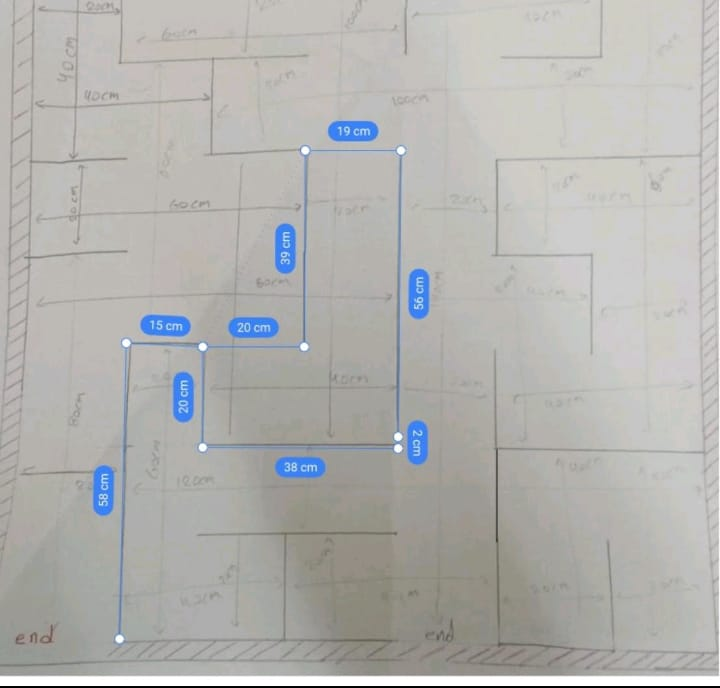

# TRANSFORMAZE — Autonomous Maze-Solving Robot

An Arduino Uno robot that navigates a wooden maze on its own using three HC-SR04 ultrasonic sensors (front, left, right).

## Features
Autonomy · speed and efficiency · sensor integration · ultrasonic sensing · flexible design · compatibility with other technologies · educational challenges

## Hardware
- Arduino Uno
- L298N motor driver
- 2 DC motors + wheels, 2-wheel chassis (11 × 17.4 cm)
- 3 × HC-SR04 ultrasonic sensors
- 12 V power supply



## Pin mapping
| Function | Pin |
|---|---|
| Motor 1 direction | 5, 6 |
| Motor 2 direction | 7, 8 |
| Motor 1 / Motor 2 speed (PWM) | 3 / 11 |
| Front sensor (trig / echo) | 9 / 10 |
| Left sensor (trig / echo) | A0 / A1 |
| Right sensor (trig / echo) | A2 / A3 |

## How it works
Each loop reads the three distances (average of 5 pings per sensor) and prints them over Serial at 9600 baud. With `threshold = 20` cm:

1. **Front blocked** → stop, reverse, then turn toward the side with more free space.
2. **Left blocked** → stop, turn right.
3. **Right blocked** → stop, turn left.
4. **Otherwise** → drive forward.

Source: [`firmware/transformaze/transformaze.ino`](firmware/transformaze/transformaze.ino)

## Maze
| Photo | Plan |
|---|---|
|  |  |

## Upload / run
1. Open `firmware/transformaze/transformaze.ino` in the Arduino IDE.
2. Select **Arduino Uno** and the correct port, then upload.
3. Open the Serial Monitor at 9600 baud to see the sensor readings.

# 🤖 TRANSFORMAZE — Autonomous Maze-Solving Robot

**TRANSFORMAZE** is an autonomous Arduino-based robot designed to navigate a handcrafted wooden maze without human control.

The robot uses **three HC-SR04 ultrasonic sensors** to continuously measure the distance in front, left, and right, then makes real-time movement decisions based on detected obstacles.

## 🚀 Project Overview

TRANSFORMAZE combines embedded systems, Arduino programming, ultrasonic sensing, motor control, and real-time decision making to create an autonomous maze-solving robot.

The robot continuously analyzes its surroundings and adjusts its movement according to the available space.

## ✨ Features

- 🤖 Autonomous maze navigation
- 📡 Three-direction ultrasonic sensing
- 🧠 Real-time obstacle detection
- ⚙️ Dual DC motor control
- 🔄 Automatic reversing and turning
- 📊 Real-time sensor readings through Serial Monitor
- 🎯 Adjustable obstacle threshold
- 🪵 Handcrafted wooden maze
- 🔌 Arduino-based embedded system

## 🧰 Hardware

| Component | Description |
|---|---|
| **Arduino Uno** | Main microcontroller |
| **L298N** | Dual H-Bridge motor driver |
| **2 × DC Motors** | Robot movement |
| **2-Wheel Chassis** | 11 × 17.4 cm |
| **3 × HC-SR04** | Front, left, and right distance sensing |
| **12V Power Supply** | System power |
| **Wheels** | Mechanical movement |

### 🤖 Robot


## 🔌 Pin Mapping

| Function | Pin |
|---|---|
| Motor 1 Direction | 5, 6 |
| Motor 2 Direction | 7, 8 |
| Motor 1 Speed (PWM) | 3 |
| Motor 2 Speed (PWM) | 11 |
| Front Sensor — Trig | 9 |
| Front Sensor — Echo | 10 |
| Left Sensor — Trig | A0 |
| Left Sensor — Echo | A1 |
| Right Sensor — Trig | A2 |
| Right Sensor — Echo | A3 |

## 🧠 How It Works

Each loop reads the distance from the three ultrasonic sensors.

To improve measurement stability, the robot takes an **average of 5 readings per sensor**.

The default obstacle threshold is:

```cpp
threshold = 20; // cm
```

### Navigation Logic

1. **Front blocked** → Stop, reverse, then turn toward the side with more free space.
2. **Left blocked** → Stop and turn right.
3. **Right blocked** → Stop and turn left.
4. **No obstacle detected** → Continue moving forward.

### Decision Flow

```text
              ┌──────────────────┐
              │ Read 3 Sensors   │
              └────────┬─────────┘
                       ↓
              ┌──────────────────┐
              │ Front < 20 cm ?  │
              └───────┬──────────┘
                   Yes│
                      ↓
              ┌──────────────────┐
              │ Stop + Reverse   │
              └────────┬─────────┘
                       ↓
              Compare Left / Right
                       ↓
             Turn toward open side

                       No
                       ↓
              ┌──────────────────┐
              │ Left < 20 cm ?   │
              └───────┬──────────┘
                   Yes│
                      ↓
                 Turn Right

                       No
                       ↓
              ┌──────────────────┐
              │ Right < 20 cm ?  │
              └───────┬──────────┘
                   Yes│
                      ↓
                  Turn Left

                       No
                       ↓
                 Move Forward
```

## 🪵 Maze

The robot was designed and tested to navigate through a handcrafted wooden maze.

| Maze Photo | Maze Plan |
|---|---|
|  |  |

## 💻 Software

The robot firmware is written in **C++** using the Arduino IDE.

### Technologies

- Arduino IDE
- C++
- Arduino Uno
- HC-SR04 Ultrasonic Sensors
- L298N Motor Driver

### Source Code

The main firmware is available here:

```text
firmware/
└── transformaze/
    └── transformaze.ino
```

[View `transformaze.ino`](firmware/transformaze/transformaze.ino)

## ▶️ Upload & Run

### 1. Open the firmware

Open:

```text
firmware/transformaze/transformaze.ino
```

in the **Arduino IDE**.

### 2. Select Arduino Uno

Choose:

```text
Board: Arduino Uno
```

Then select the correct serial port.

### 3. Upload the firmware

Connect the Arduino Uno and upload the program.

### 4. Open Serial Monitor

Open the Serial Monitor and set the baud rate to:

```text
9600 baud
```

The sensor readings will be displayed continuously.

## 📁 Project Structure

```text
TRANSFORMAZE/
│
├── firmware/
│   └── transformaze/
│       └── transformaze.ino
│
├── images/
│   ├── robot.png
│   ├── maze-photo.jpg
│   └── maze-plan.jpg
│
└── README.md
```

## 🔮 Future Improvements

- 📡 Add infrared sensors for improved edge detection
- 🧠 Implement smarter pathfinding
- 🗺️ Add maze mapping
- 📱 Add Bluetooth integration
- 🎮 Add remote-control mode
- ⚡ Improve motor speed control
- 🎯 Improve turning accuracy
- 🤖 Develop more advanced autonomous navigation

## 📚 Learning Outcomes

This project provided practical experience with:

- Arduino programming
- Embedded systems
- Ultrasonic sensors
- Motor control
- Hardware integration
- Sensor calibration
- Real-time decision making
- Autonomous navigation
- Debugging and testing

## 📌 Project Status

**Completed — Prototype**

TRANSFORMAZE demonstrates autonomous maze navigation using ultrasonic obstacle detection and Arduino-based motor control.

## 📄 License

This project was created for educational and academic purposes.
