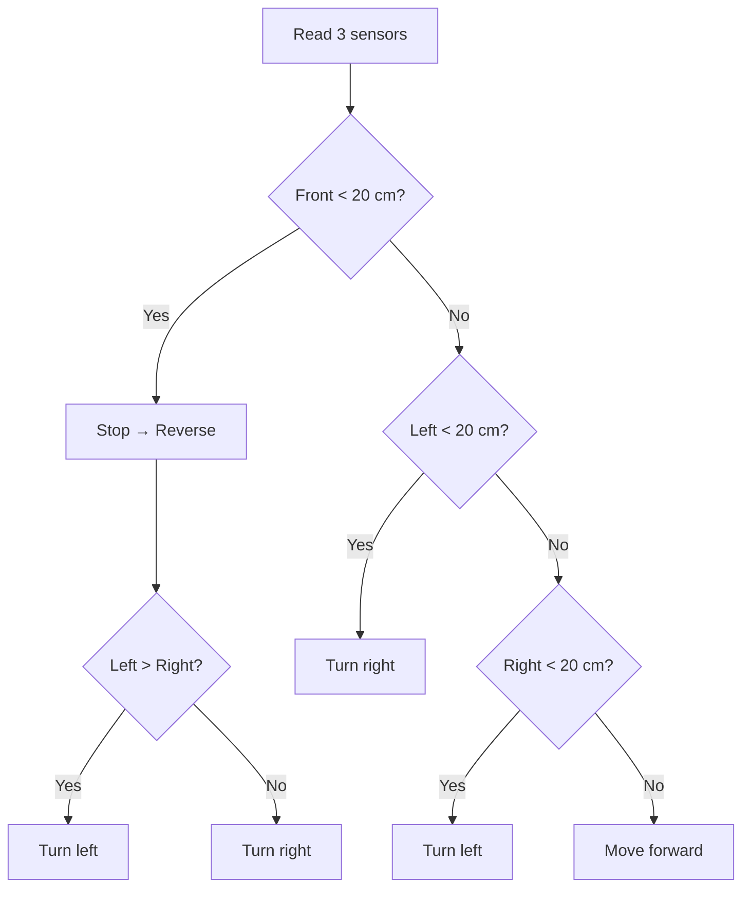

# 🤖 TRANSFORMAZE — Autonomous Obstacle-Avoiding Maze Robot

An Arduino Uno robot that drives through a handcrafted wooden maze on its own, using three **HC-SR04 ultrasonic sensors** (front, left, right) and an **L298N** motor driver.


## Features

- Autonomous navigation, no remote control
- Three-direction distance sensing (front / left / right)
- Averaged readings (5 pings per sensor) for more stable distances
- Automatic stop, reverse, and turn when blocked
- Live distance readings over Serial Monitor
- Adjustable obstacle threshold (`threshold`, default 20 cm)

## Hardware

| Component | Notes |
|---|---|
| Arduino Uno | Main controller |
| L298N | Dual H-bridge motor driver |
| 2 × DC motors + wheels | 2-wheel chassis, 11 × 17.4 cm |
| 3 × HC-SR04 | Front, left, right distance sensing |
| 12 V power supply | System power |

## Pin Mapping

| Function | Pin |
|---|---|
| Motor 1 direction | 5, 6 |
| Motor 2 direction | 7, 8 |
| Motor 1 speed (PWM) | 3 |
| Motor 2 speed (PWM) | 11 |
| Front sensor (Trig / Echo) | 9 / 10 |
| Left sensor (Trig / Echo) | A0 / A1 |
| Right sensor (Trig / Echo) | A2 / A3 |

## How It Works

Every loop, the robot measures the three distances (average of 5 pings per sensor, valid range 1–399 cm), prints them to the Serial Monitor at 9600 baud, then decides what to do. With `threshold = 20` cm:

| Condition | Action |
|---|---|
| Front < threshold | Stop (500 ms) → reverse (500 ms) → turn toward the side with more free space |
| Left < threshold | Stop (200 ms) → turn right |
| Right < threshold | Stop (200 ms) → turn left |
| Otherwise | Drive forward |

The checks run in that order, so the front sensor always has priority. Motors run at PWM 200 (out of 255). Turns are pivots on one wheel for a fixed 500 ms.



## Maze

| Photo | Plan |
|---|---|
|  |  |

## Upload & Run

1. Open `firmware/transformaze/transformaze.ino` in the Arduino IDE.
2. Select **Arduino Uno** and the correct port, then upload.
3. Open the Serial Monitor at **9600 baud** to see the readings.
4. Power the motors from the 12 V supply and place the robot in the maze.

No external libraries are required.

## Limitations

- **Reactive, not a true maze solver.** The robot avoids walls using the current sensor readings only. It has no memory, mapping, or pathfinding, so it can loop in some maze layouts.
- **No-echo readings count as 0.** If a sensor gets no echo (out of range or an angled surface), that ping adds 0 to the average, which can make a free direction look blocked.
- **Timed turns.** Turn angle depends on the fixed 500 ms delay, battery level, and surface, since there is no encoder or gyro feedback.
- **Blocking delays.** The robot does not read sensors during stop, reverse, or turn.
- **Blind reverse.** There is no sensor at the back.

## Future Improvements

- Wall-following or a flood-fill algorithm for real maze solving
- Treat no-echo readings as "far" instead of 0
- Encoders or a gyroscope for accurate turns
- Smoother motor speed control instead of fixed PWM
- Bluetooth remote-control mode

## Tech Stack

C++ · Arduino Uno · HC-SR04 · L298N · PWM motor control

## Project Structure

```text
TRANSFORMAZE/
├── firmware/
│   └── transformaze/
│       └── transformaze.ino
├── images/
│   ├── robot.png
│   ├── maze-photo.jpg
│   └── maze-plan.jpg
└── README.md
```

## License

Created for educational and academic purposes.
